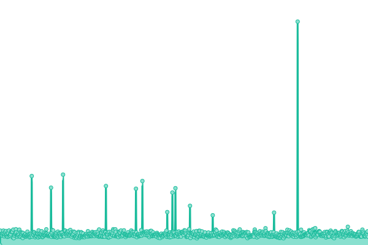
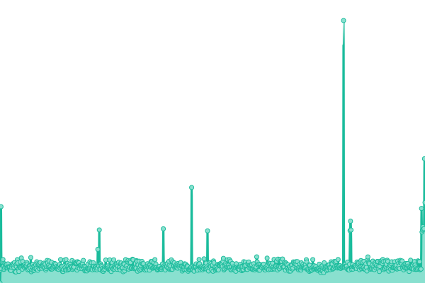
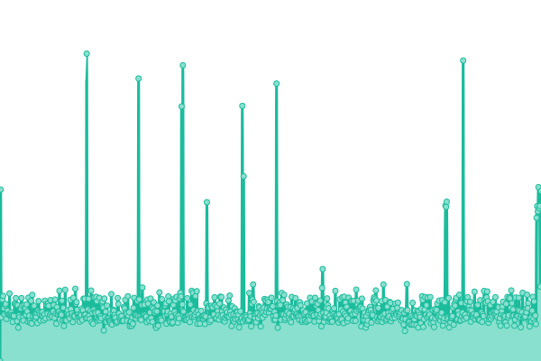
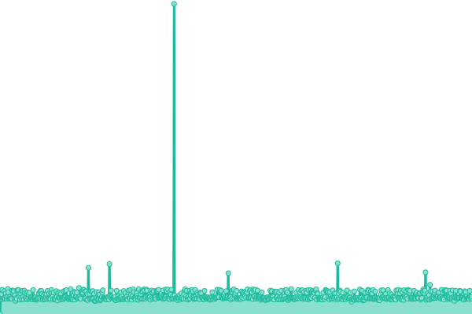

# [📈 Live Status](https://CarlosDaza97.github.io/cyw-services): <!--live status--> **🟧 Partial outage**

This repository contains the open-source uptime monitor and status page for [CarlosDaza97](https://CarlosDaza97.github.io/cyw-services), powered by [Upptime](https://github.com/upptime/upptime).

With [Upptime](https://upptime.js.org), you can get your own unlimited and free uptime monitor and status page, powered entirely by a GitHub repository. We use [Issues](https://github.com/CarlosDaza97/cyw-services/issues) as incident reports, [Actions](https://github.com/CarlosDaza97/cyw-services/actions) as uptime monitors, and [Pages](https://CarlosDaza97.github.io/cyw-services) for the status page.

<!--start: status pages-->
<!-- This summary is generated by Upptime (https://github.com/upptime/upptime) -->
<!-- Do not edit this manually, your changes will be overwritten -->
<!-- prettier-ignore -->
| URL | Status | History | Response Time | Uptime |
| --- | ------ | ------- | ------------- | ------ |
|  [Agent Online Ordering - Bogotá](https://www.domicilioscrepesywaffles.com.co) | 🟩 Up | [agent-online-ordering-bogota.yml](https://github.com/CarlosDaza97/cyw-services/commits/HEAD/history/agent-online-ordering-bogota.yml) | 

 1832ms
     
 | 

<a href="https://CarlosDaza97.github.io/cyw-services/history/agent-online-ordering-bogota">100.00%</a>
    

|  [Agent Online Ordering - Barranquilla](https://caribe.domicilioscrepesywaffles.com.co) | 🟩 Up | [agent-online-ordering-barranquilla.yml](https://github.com/CarlosDaza97/cyw-services/commits/HEAD/history/agent-online-ordering-barranquilla.yml) | 

 1524ms
     
 | 

<a href="https://CarlosDaza97.github.io/cyw-services/history/agent-online-ordering-barranquilla">100.00%</a>
    

|  [Agent Online Ordering - Cali](https://maquite.domicilioscrepesywaffles.com.co) | 🟩 Up | [agent-online-ordering-cali.yml](https://github.com/CarlosDaza97/cyw-services/commits/HEAD/history/agent-online-ordering-cali.yml) | 

 1430ms
     
 | 

<a href="https://CarlosDaza97.github.io/cyw-services/history/agent-online-ordering-cali">100.00%</a>
    

|  [Agent Online Ordering - Cartagena](https://cartagena.domicilioscrepesywaffles.com.co) | 🟩 Up | [agent-online-ordering-cartagena.yml](https://github.com/CarlosDaza97/cyw-services/commits/HEAD/history/agent-online-ordering-cartagena.yml) | 

 1378ms
     
 | 

<a href="https://CarlosDaza97.github.io/cyw-services/history/agent-online-ordering-cartagena">100.00%</a>
    

|  [Integración Rappi/Aloha - Bogotá](https://cwmenu.infotranscolombia.com) | 🟥 Down | [integracion-rappi-aloha-bogota.yml](https://github.com/CarlosDaza97/cyw-services/commits/HEAD/history/integracion-rappi-aloha-bogota.yml) | 

 0ms
     
 | 

<a href="https://CarlosDaza97.github.io/cyw-services/history/integracion-rappi-aloha-bogota">0.00%</a>
    

|  [Servicios de integración APIs](https://omsaloha.infotranscolombia.com/v1/Manu/StoreStatus/1) | 🟥 Down | [servicios-de-integracion-ap-is.yml](https://github.com/CarlosDaza97/cyw-services/commits/HEAD/history/servicios-de-integracion-ap-is.yml) | 

 0ms
     
 | 

<a href="https://CarlosDaza97.github.io/cyw-services/history/servicios-de-integracion-ap-is">0.00%</a>
    

|  [Captura de datos de clientes](https://factelectronica.domicilioscrepesywaffles.com.co) | 🟥 Down | [captura-de-datos-de-clientes.yml](https://github.com/CarlosDaza97/cyw-services/commits/HEAD/history/captura-de-datos-de-clientes.yml) | 

 793ms
     
 | 

<a href="https://CarlosDaza97.github.io/cyw-services/history/captura-de-datos-de-clientes">0.00%</a>
    

<!--end: status pages-->

[**Visit our status website →**](https://CarlosDaza97.github.io/cyw-services)

## 📄 License

- Powered by: [Upptime](https://github.com/upptime/upptime)
- Code: [MIT](./LICENSE) © [CarlosDaza97](https://CarlosDaza97.github.io/cyw-services)
- Data in the `./history` directory: [Open Database License](https://opendatacommons.org/licenses/odbl/1-0/)
